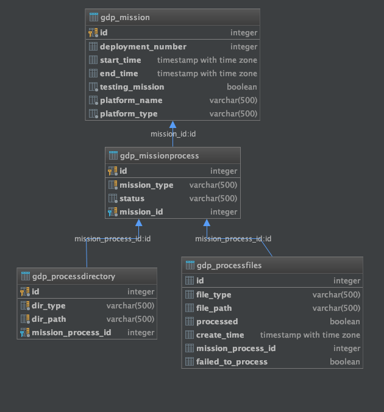
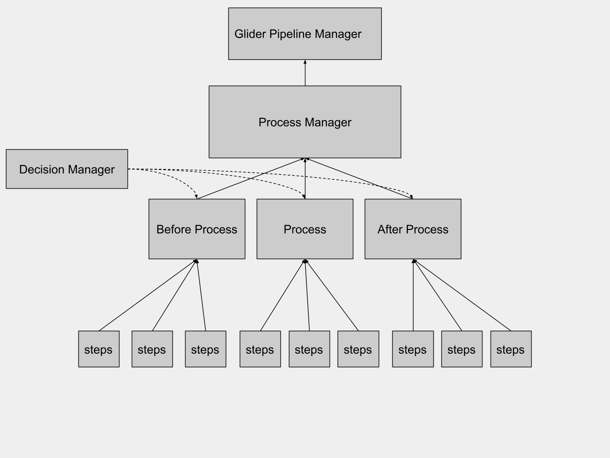
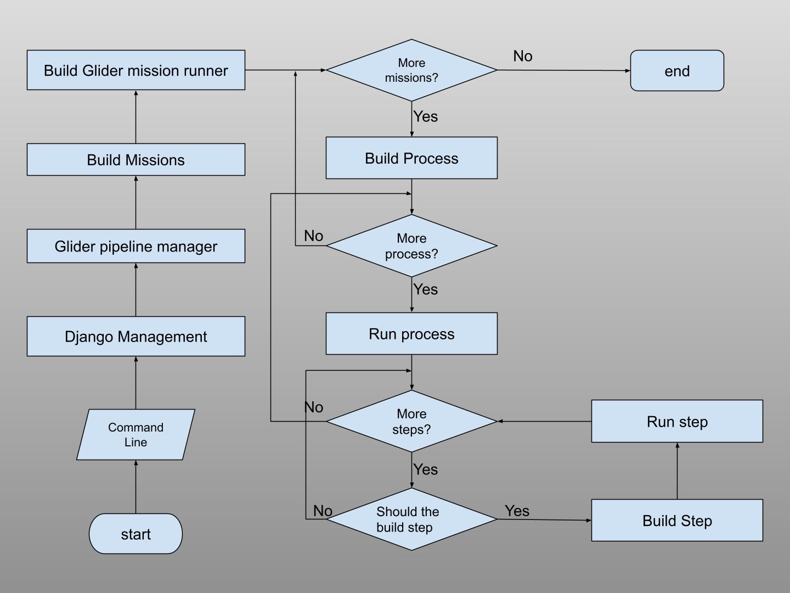
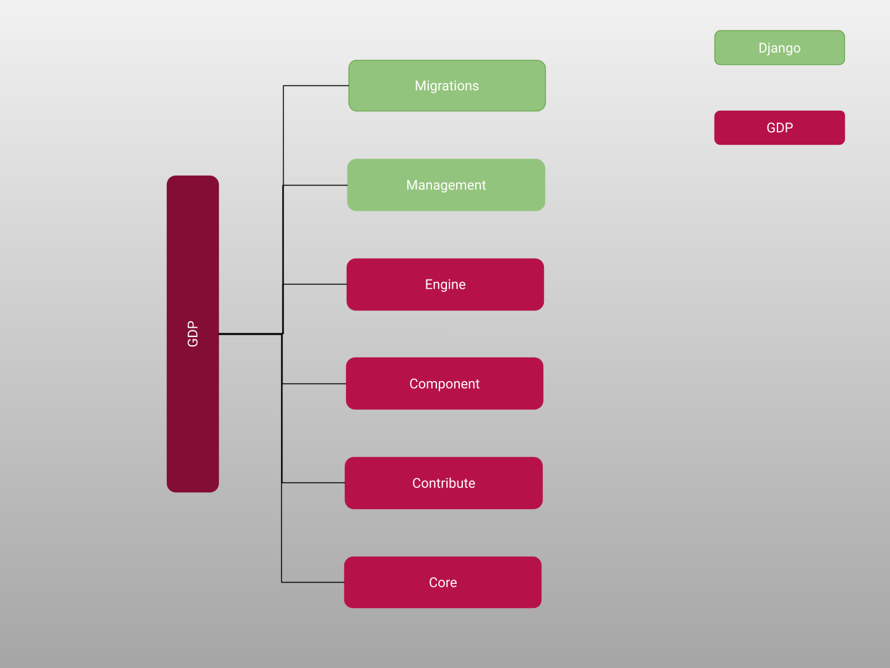
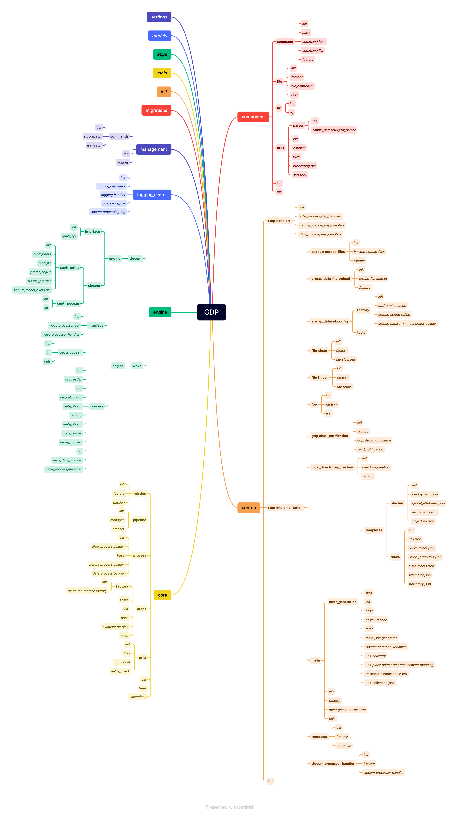
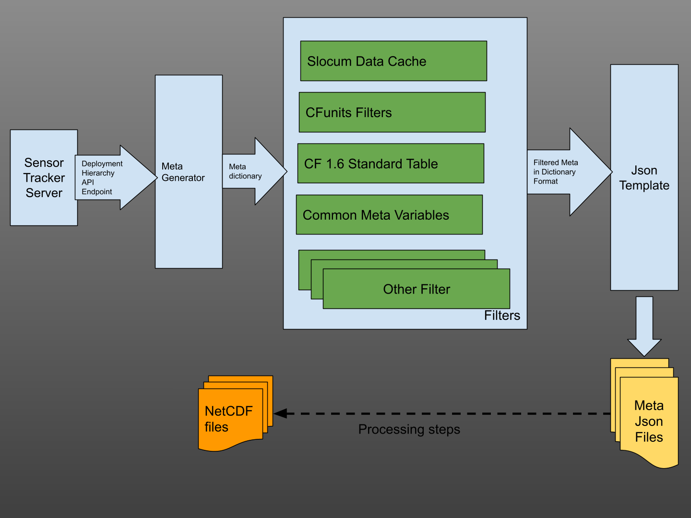
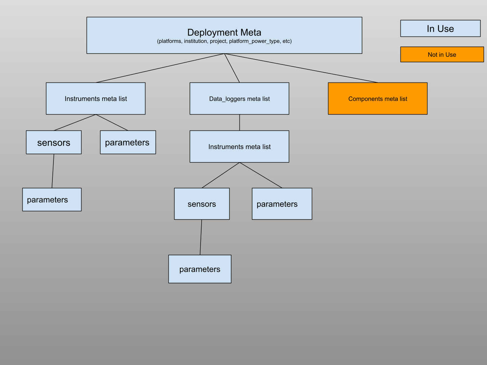

# Glider Data Pipeline

## Overview

GDP (Glider Data Pipeline) is a program which can automatically process realtime and delayed slcoum dataset.

Repo: https://gitlab.oceantrack.org/ceotr/gliders/gdp

## Rundeck Jobs

Both realtime and delayed mode process handled by Rundeck server

- Relatime
- Delayed

## Setup

Requirements:

- postgres database
- GenerateDatasetsXml
- Linux server

```shell
git clone git@gitlab.oceantrack.org:ceotr/gliders/gdp.git
cd gdp
conda env create -f environemtn.yml
source activate GDP
python manage.py migrate
python manage.py slocum_run
# for the first run, it will throw out the exception for fill out pw_info.yml
```

## Useful Commands

Autodetect mission and processing commands

- process slocum realtime mission
- process high resolution data for most recent unprocessed slocum mission
- process high resolution data for mission 136

## Database

Database chosen: Postgres
**Purpose**:

- Record data processing status.

**Goals**:

1. Tracking data files' processed status
2. Tracking missions' processed status
3. Able to handler multiprocess

### Structure



- Mission table
- Mission_process table
- Process_dir table
- Process_files table

### Modules

- conf:
    - The module works with setting and configurations
- core:
    - Pipeline major logic
- db:
    - Handle database stuff
- engine:
    - Module for place data processors
- management:
    - Place for commands, and start point of the program
- meta:
    - Modules stream data from sensor_tracker Restful api server
- Parser:
    - For parsers, Planning to remove
- Utils:
    - Random useful functions

## Code and Design

**OOP High level abstract design diagram**


**Workflow**


**File Structure**



### Folder Explanation

- Engine: place for data process code
- Component: place for useful tools which can be shared in the GDP project
- contribute: place to add steps
- core: place to define GDP bone and workflow

## Meta Generator

Meta-Generator is a module of GDP which can be used to generate meta JSON files. The meta JSON files will be used to
generate nc files. Meta JSON files contain almost all the Metadata for a glider dataset except few such as

dataset_ids, dataset_title and etc.



There are three major steps for the meta-generator to generate the Meta JSON files

1. Request and reformat data from the sensor tracker 
   - The meta-generator used sensor tracker's Deployment Hierarchy API endpoint for data request
2. Apply filters to the data
3. Feed the data to the JSON template

Then write the JSON files to the disk.


