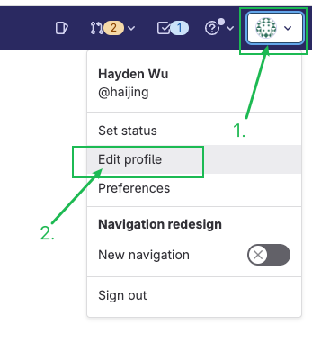
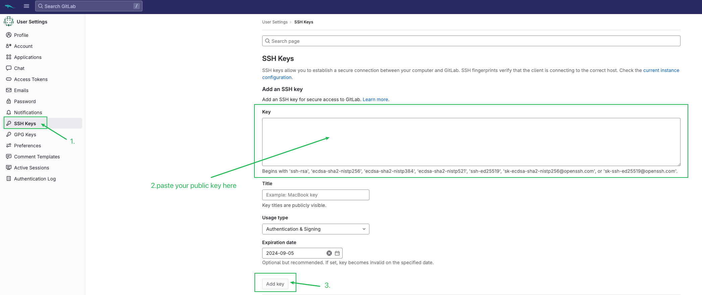
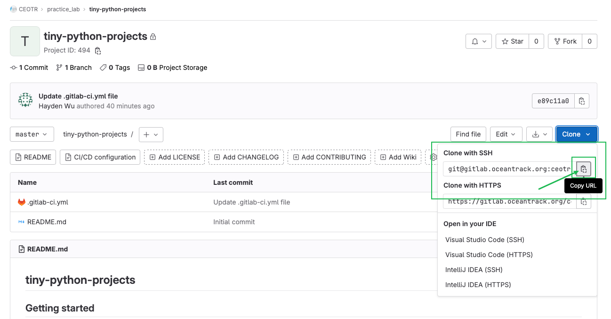

# How to clone a GitLab repository with SSH

## Step 0: Generate an SSH key pair locally

See [How to generate an SSH key pair](ssh-key.md) for more details.

## Step 1: Copy your public key

You can now use the public key (`~/.ssh/id_rsa.pub`) to authenticate on remote servers or services. To copy it to your
clipboard, you can use the `cat` command and pipe it to `pbcopy` (on macOS) or xclip (on Linux):

=== "macOS"

    ```shell
    cat ~/.ssh/id_rsa.pub | pbcopy
    
    ```

=== "Linux (with `xclip` installed)"

    ```shell
    cat ~/.ssh/id_rsa.pub | xclip -sel clip
    
    ```

## Step 2: Set up your SSH key on GitLab



Click the Edit profile button, or go to your GitLab profile page: `https://gitlab.oceantrack.org/-/profile`



Paste your public key in the Key text area and click the Add key button to add the key.

## Step 3: Copy the SSH URL and clone the repository



Navigate to your desired directory and clone a Git repository with the SSH URL, for example:

```shell
git clone git@gitlab.oceantrack.org:ceotr/practice_lab/tiny-python-projects.git
```

If you want to clone a specific branch of a Git repository, you can do so by specifying the branch you want to clone
after the repository URL.

For example, if you wanted to clone the dev (development) branch from the above repository (if the branch exists):

```shell
git clone -b dev git@gitlab.oceantrack.org:ceotr/practice_lab/tiny-python-projects.git
```

## Resources

[Use SSH keys to communicate with GitLab | GitLab Docs](https://docs.gitlab.com/user/ssh/#generate-an-ssh-key-pair) 