# Welcome to Gliders Documentation 🚀

## Choose where to start:

- [How-to Guides](how/ssh-key.md)
- [Glider Data Pipeline](gdp/gdp.md)

## Mermaid Demo
!!! tip
    Use either `pymdownx.superfences` extension or `mermaid2` plugin to display mermaid diagrams in MKDocs. 

**Example**:
```yaml
- pymdownx.superfences:
  custom_fences:
    - name: mermaid
      class: mermaid
      format: !!python/name:pymdownx.superfences.fence_code_format
```

### Data flow

``` mermaid
    %%{
      init: {
        'theme': 'base',
        'themeVariables': {
          'primaryColor': '#A3F7B5',
          'primaryTextColor': '#000',
          'primaryBorderColor': '#000',
          'lineColor': '#444',
          'secondaryColor': '#FAFAFA',
          'tertiaryColor': '#FFD166'
        }
      }
    }%%
    
    flowchart LR
        %% Nodes
        data_acq@{ shape: circle, label: "Data Acquisition"}
        qc((QC))
        schemas@{ shape: docs, label: "Project Schemas (tags, station deployments, detections)"}
        obis[obis]
        discovery[discovery]
        geoserverSchema["geoserver"]
        geoserver(("Geoserver"))
        erddapSchema["erddap"]
        erddap["ERDDAP"]
        web[🌐 Web Publishing]
        db@{ shape: lin-cyl, label: "Database"}
    
        %% Flows
        data_acq --> schemas
        qc --> schemas
        schemas ~~~ 
        %% schemas ~~~ is used for positioning the QC to Project Schemas, without using it, lines will be crossed
        schemas --> qc
        schemas -- moorings, animals, tags --> obis
    
        obis -- publication scripts --> erddapSchema
        obis -- summaries / node aggregation --> discovery
        
        discovery --> web
        discovery -- nodes --> db
        discovery ~~~
        %% similarly ~~~ is used to prevent line crossing
        discovery -- project metadata--> geoserverSchema
    
        obis -- station data --> geoserverSchema
        geoserverSchema --> geoserver
        erddapSchema --> erddap
    
        %% Styles
        classDef schemaNode fill:#EEE6FF,stroke:#000000,stroke-width:1px,color:#000000;
        classDef obisNode fill:#CFCFCF,stroke:#CFCFCF,stroke-width:1px,color:#000000,font-weight:bold;
        classDef discoveryNode fill:#FFD166,stroke:#FFD166,stroke-width:1px,color:#000000;
        classDef erddapNode fill:#2294A8,stroke:#2294A8,stroke-width:1px,color:#fff;
        classDef geoserverNode fill:#fff,stroke:#58A4D4,stroke-width:2px,color:#58A4D4, font-weight:bold;
        classDef webNode fill:#F0EFEB,stroke:#999999,stroke-width:1px,color:#000000;
        classDef dbNode fill:#A0C4FF,stroke:#000,stroke-width:1px,color:#000000;
        classDef commonSchemaNode fill:#FFD166,stroke:#FFD166,stroke-width:1px,color:#000000;
    
        class schemas schemaNode;
        class obis commonSchemaNode;
        class discovery commonSchemaNode;
        class erddapSchema commonSchemaNode;
        class geoserverSchema commonSchemaNode;
        class geoserver geoserverNode;
        class web webNode;
        class db dbNode;
        class erddap erddapNode;
```

### OBIS Schema Integration


## Admonitions

!!! tip
    Tip block

!!! warning
    Warning block

!!! note
    Note block

!!! info
    Info block

!!! success
    Success block

!!! danger
    Danger block

!!! example
    Example block

??? info "Click to expand Wave Glider notes"
    - note 1
    - note 2

## Mathematics
The depth calculation from pressure:

$$
\begin{aligned}
P &= P_0 + \rho g z \\
z &= \frac{P - P_0}{\rho g}
\end{aligned}
$$
